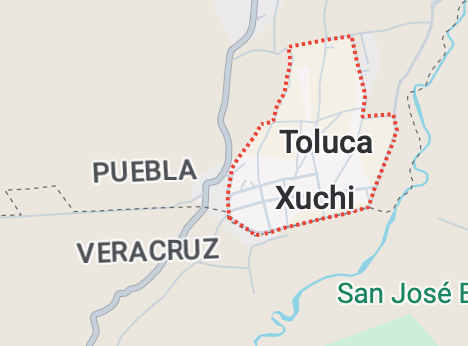
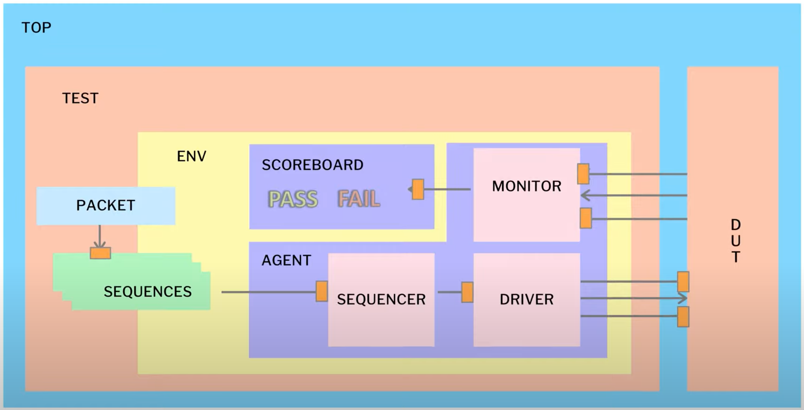

# SUMADOR IP UVM Verification




The UVM architecture has many modules where each module has specific task. The next figure show how this architecture is connect using .

- Top
 - Test
  - Environment
   - Agent 
    - Monitor
    - Driver
    - Sequencer
- DUT    




Este proyecto tiene como objetivo que el usuario entienda como se construye una arquitectura UVM Básica.

## Setup

A continuación se colocan una serie de comando que deben ejecutarse desde terminal.

```bash
export GIT_ROOT=$(git rev-parse --show-toplevel)
export UVM_WORK="$GIT_ROOT/work/uvm"
mkdir -p work/uvm && cd work/uvm
ln -sf $GIT_ROOT/verification/uvm/scripts/makefiles/Makefile.xilinx Makefile
ln -sf $GIT_ROOT/verification/uvm/scripts/setup/setup_vivado_eda.sh
source setup_synopsys_eda.tcsh
make
```
