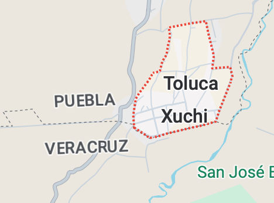
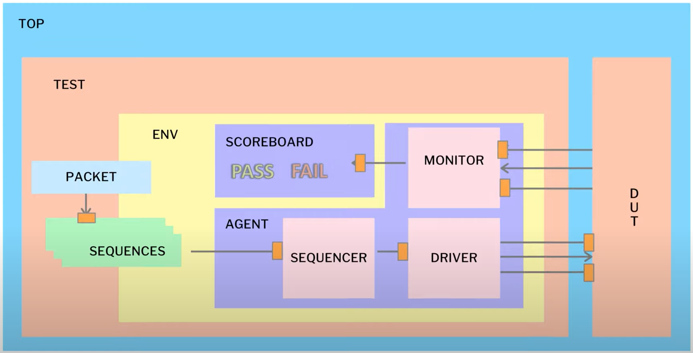

# SUMADOR IP UVM Verification




The UVM architecture consists of many modules, where each module has a specific task.
The following figure shows how this architecture is connected using the UVM hierarchy:
- Top
  - Test
    - Environment
      - Agent 
        - Monitor
        - Driver
        - Sequencer
- DUT    




Este proyecto tiene como objetivo que el usuario entienda como se construye una arquitectura UVM Básica.

## Setup

A continuación se colocan una serie de comando que deben ejecutarse desde terminal.

```bash
export GIT_ROOT=$(git rev-parse --show-toplevel)
export UVM_WORK="$GIT_ROOT/work/uvm"
mkdir -p work/uvm && cd work/uvm
ln -sf $GIT_ROOT/verification/uvm/scripts/makefiles/Makefile.xilinx Makefile
ln -sf $GIT_ROOT/verification/uvm/scripts/setup/setup_vivado_eda.sh
source setup_vivado_eda.sh
make
```
make compile
make elaborate
make sim VERBOSITY=UVM_DEBUG #Solo ver mensajes
make sim VERBOSITY=UVM_DEBUG GUI_MODE=true # abrir la interfaz grafica

# Configurar directorio de cobertura
set_property xsim.elaborate.coverage.dir ./ [get_filesets sim_1]

# Tipo de cobertura
set_property xsim.elaborate.coverage.type objects [get_filesets sim_1]

# Exportar reporte HTML
export_xsim_coverage -open_html true

# Guardar base de datos de cobertura
write_xsim_coverage -cov_db_name ./add_new_dir/add_new_cov_name

set_property xsim.elaborate.coverage.dir ./ [get_filesets sim_1]
set_property xsim.elaborate.coverage.type objects [get_filesets sim_1]
export_xsim_coverage
<!-- export_xsim_coverage -open_html true-->
exec xdg-open ./xsim_coverage_report/functionalCoverageReport/dashboard.html &
write_xsim_coverage -cov_db_name ./add_new_dir/add_new_cov_name
